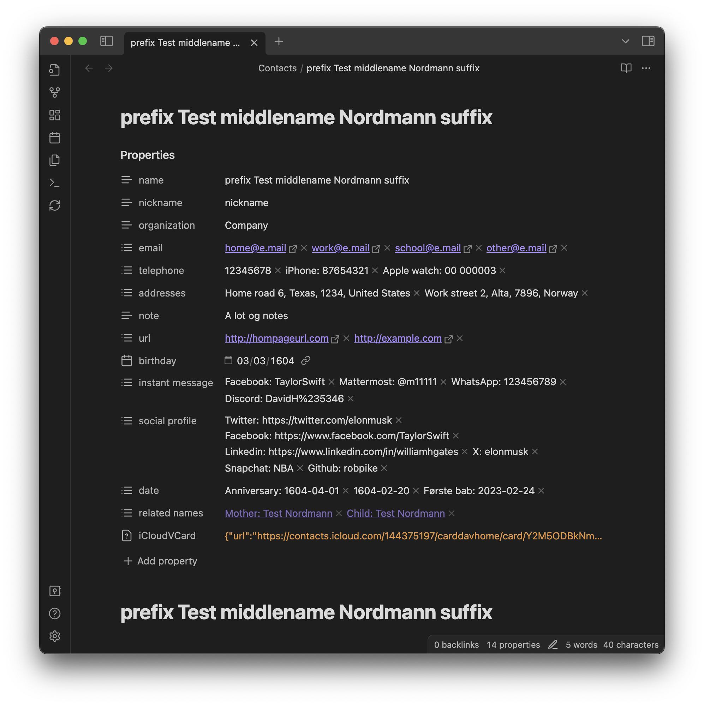

# Obsidian iCloud contacts

	
    
	
	
	

This plugin provides functions to sync contacts from your iCloud account to a folder in your vault. A contact file will look something like this.

## Features

-   Sync contacts from your iCloud to Obsidian
-   Creates a file for each contact with properties corresponding to contact details.
-   This plugin only updates the properties, the title and the top H1 header (the name). Any further info written in the files will not be touched when updating the contact.

## How to use

1. Install this plugin
2. Add username and app specific password to the settings.
3. Run the command `Obsidian iCloud contacts: Update contacts` to sync your contacts
4. After syncing is complete, you will see a notification stating how many Contacts have been synced.

## Commands

This plugin provides two commands. Use the command pallet to search for **Obsidian iCloud contacts** and use one of the two commands to update your contacts folder.

1. **Update Contacts**: Downloads all contacts from iCloud and updates the contacts files in you vault that based what contacts have been updated in iCloud.
2. **Update all Contacts**: - Downloads alle contacts form iCloud and rewrites all contacts files in your vault based on the contacts from iCloud. Usefull for when you have changed the Excluded keys setting.

## Notes

-   The **iCloudVCard** property is used to update contacts that have been changed. I also like it as a backup of my contacts in my vault.
-   This plugin is not affiliated with Apple in any way.

## Thanks

The IcloudClient in this codebase is copied and adapted from [tsdav](https://github.com/natelindev/tsdav).

## Support

If you want to support me and my work, you can [bye me a coffee](https://www.buymeacoffee.com/truls).

